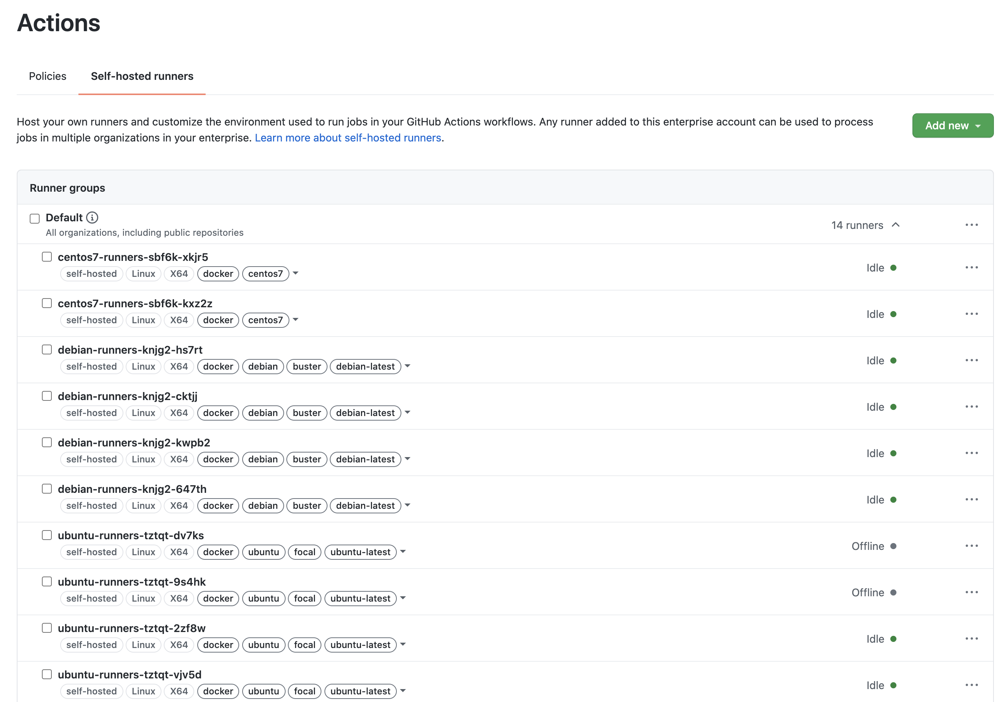
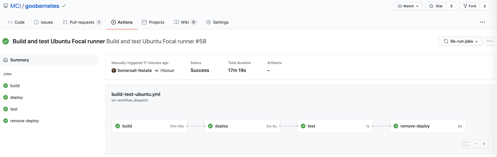

# Initial setup in GHES

Here's a (hopefully complete) step-by-step guide to getting this repository and setting this up in a new GHES instance.

1. Clone this repository to your a machine with Docker installed.  We'll need to do the very first set of runners manually, so that GitHub has runners to build its' runners on.  We'll come back to this in a bit.
2. Mirror this repository to your GHES server.  [Directions](https://docs.github.com/en/github/creating-cloning-and-archiving-repositories/creating-a-repository-on-github/duplicating-a-repository)
3. Now let's set up some credentials.  You'll the following:
   1. An enterprise admin account with a PAT using the `enterprise:admin` scope.  This is used by the runner controller to control the runners joined to GHES in the setup docs [here](../kubernetes/SETUP.md)
   2. A non-admin account that can read from the repo (or org) where you're going to publish the Docker images to GitHub Packages.  This account needs a PAT with the `read:packages` scope and is used by the runner controller as the image pull secret.  In the setup docs, I called this secret `ghe`.
   3. The [setup docs](../kubernetes/SETUP.md) have you create two namespaces, `runners` and `test-runners`.  There are two service account YAML files, one for each namespace, for GHES to use to deploy itself.  Please apply them using `kubectl apply -f serviceaccount.yml` and copy the `kubeconfig` file for each.  You will need to save it to a text file, then use `cat filename.txt | base64` to base64 encode it.  This big string of gibberish will become the two GitHub Secrets used by the deployment workflows.
   4. A non-admin account that owns the repo (or org) where you're going to publish the Docker images to GitHub Packages.  This account needs a PAT with the `delete:packages` and `write:packages` scopes.  It's used in GitHub Secrets as `GHE_TOKEN` to publish the packages and the username is saved as `GHE_USERNAME`.
4. Move the `github/workflows` directory to `.github/workflows` in the new repository.  I don't want to clutter up this repo in .com with things that will fail because it's assuming non-standard runners.
5. Now let's build and push the first set of runners.  From the machine you cloned this to on step #1, let's run the following to build and push that first set.

    ```shell
    cd images/
    docker login docker.your-ghe-url
    docker build -f image-name.Dockerfile -t tag-goes-here .
    docker push tag-goes-here
    ```

6. Next, let's set up the runner controller as outlined [here](../kubernetes/SETUP.md) and use the [deployments](../../deployments/README.md) to create the first set of runners.  Wait a few minutes for the deployment to complete.
7. Log in to your GHE server and navigate to `HOSTNAME/enterprises/ENTERPRISE-NAME/settings/actions/self-hosted-runners`.  You should now see something like this:

    

8. From here, the workflows should be able to build, test, and push themselves via the workflows defined for GitHub Actions.  Here's what that looks like in practice:

    
